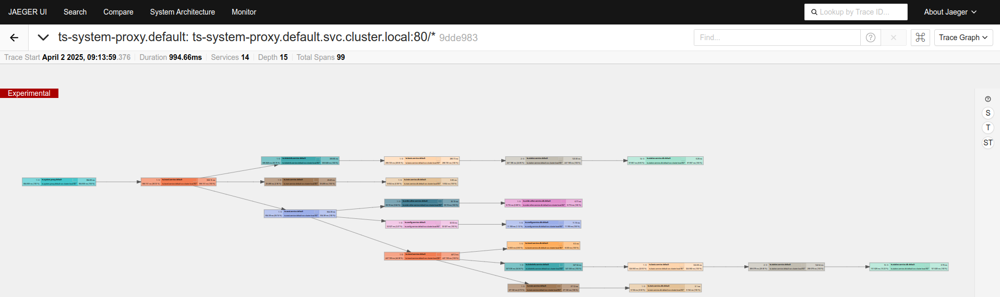

# data-anchored-placement

The placement algorithm leverages runtime information about interactions between microservices. 
For this reason, it is essential to have a pipeline for acquiring metrics related to traces.

The observability system is based on OpenTelemetry Collector, Grafana Tempo, and Prometheus to collect, analyze, 
and visualize data on application behavior.

Each microservice Pod contains a sidecar container running an Istio Proxy. 
Istio enables application monitoring without modifying the internal logic of microservices. 
It intercepts and collects traces of requests made to the application. 
The Istio sidecar sends the collected traces to an OpenTelemetry Collector. 
While Istio (dashed in the figure) is not mandatory, it is crucial that the collector receives application traces, 
which could also be instrumented directly.

The OpenTelemetry Collector receives the traces and forwards them to Tempo, which processes the incoming data. 
Tempo includes a metrics generator that analyzes the traces, extracts relevant information, and generates derived metrics 
(e.g., latency, throughput, errors, and request counts on spans). These metrics are then written to Prometheus via remote_write.

By leveraging the 'traces_service_graph_request_total' metric, the WL-A model (workload application model) can be created.

*Colarusso, C., De Caro, A., Falco, I., Goglia, L., & Zimeo, E. A distributed tracing pipeline for improving locality 
awareness of microservices applications. Software: Practice and Experience, 2024, 54.6: 1118-1140.*

The model reflects the system's behavior during usage, specifically showing the number of requests occurring between microservices.

The collector can also be used to send traces to Jaeger, which serves exclusively as a visualization tool:

The scheduler computes service-node pairs using a data-anchored logic.

*COLARUSSO, Carmine; FALCO, Ida; ZIMEO, Eugenio. A greedy data-anchored placement of microservices in federated clouds. 
In: 2024 IEEE International Conference on Cloud Computing Technology and Science (CloudCom). IEEE, 2024. p. 103-110*

In a greedy manner, it groups microservices that communicate most frequently with databases within the same node.
To achieve this, it retrieves request count metrics from Prometheus and uses them to populate a graph in Neo4j.
The algorithm primarily relies on Neo4j queries, optimized for graph-based processing.

# Prerequisites for Using the Algorithm:

- OpenTelemetry Collector: Configured to collect application traces and forward them to Grafana Tempo.
- Grafana Tempo: Set up to process incoming traces and generate relevant metrics.
- Prometheus: Used to store and retrieve the generated metrics.
- Python Configuration: Ensure the correct addresses for Prometheus and Neo4j are specified in environment variables (in k8s yaml files).
- JSON Request Structure: Databases in the request JSON must have names ending with 'db'. 
This allows the algorithm to identify and ‘anchor’ them to nodes based on their region.

